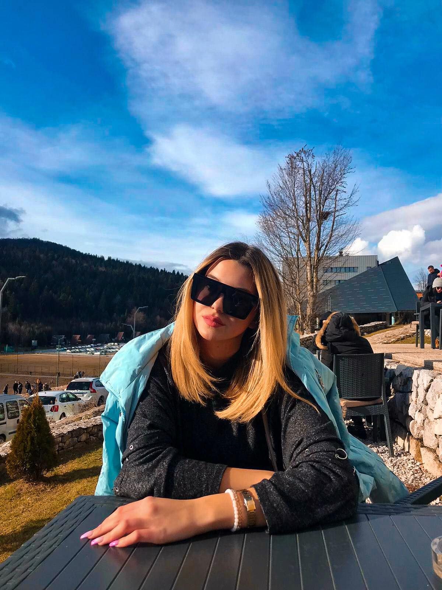
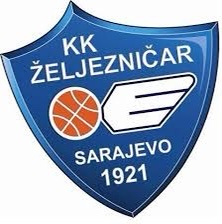
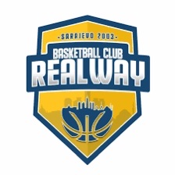

<!DOCTYPE html>
<html>
<head>
	    <meta charset="UTF-8">
	<title>Merjem Hujdur</title>
	<link rel="stylesheet" type="text/css" href="merjem.css">
</head>
<body>
		<header>
	<figure>
		
<h1 id="FirstId">Merjem Hujdur</h1>

	</figure>
		<hgroup>
				<h2 class="FirstClass"><em>Biography</em></h2>
				<nav>
	
<ul id="randomness">
		<li id="one" class="hot"><a href="#Aboutme">About me</a></li>
		<li id="two" class="hot" ><a href="#Education">Education</a></li>
		<li id="three" class="hot"><a href="#School">School</a></li>
		<li id="four" ><a href="#Work">Work</a></li>
		<li id="five" ><a href="#Skills">Skills</a></li>
		<li><a href="#Address/Contactinfo">Address/Contact info</a></li>
	</ul>
		</nav>
			</hgroup> 

		
	</header>
		<article>	
			<section>
	<h2><em>About me</em></h2>	
	
<ul><li><i><b>My name is Merjem Hujdur,and I am from Sarajevo.</b></i></li>
	<a href="https://en.wikipedia.org/wiki/Sarajevo">Sarajevo</a>
<li><b><i>I possess basketball high school awards.</i></b>
</li></ul>
<table border="20" bgcolor="lightblue">
	<tr>
		<th width="150" bgcolor="lightgreen">Team</th>
		<th bgcolor="orange">2018</th>
		<th bgcolor="purple">2019</th>
		<th width="150" bgcolor="yellow">Total medals</th>
	</tr>
	

	<figure>
		
 <figcaption><em>KKDragons</em></figcaption>
	       <figcaption><em>KKŽeljezničar</em></figcaption>
		   
<figcaption><em>KKrealway</em></figcaption>

    

</figure>
</section>
    

	<tr>
		<th>KKDdragons</th>
		<td>2 medals</td>
		<td>3 medals</td>
		<td bgcolor="#cccccc" align="middle">5 medals</td>
	</tr>
	<tr>
		<th>KKŽeljezničar</th>
		<td>4 medals</td>
		<td>7 medals</td>
		<td bgcolor="#cccccc" align="middle">11 medals</td>
	</tr>
		<th>KKRealway</th>
		<td>10 medals</td>
		<td>8 medals</td>
		<td bgcolor="#cccccc" align="middle">18 medals</td>
</table>
	

	

<dl>
	
<dt><strong><li>Role: Captain/#1</li></strong></dt>
	<dd><em><strong>centar</strong></em></dd>
	
</dl>
	

		<h2><em>Education</em></h2>
<dt><h3><em>Bachelor</em></h3></dt>

	<ul><li><b>Computer Science 2019-2023</b></li></ul>

	<a href="https://www.ius.edu.ba/">IUS</a>

		
<h3 id="Edu"><em>School</em></h3>

	<ul>
	<li><b>Prva Bošnjačka gimnazija Sarajevo</b></li>
</ul>
	<a href="https://bosnjackagim.edu.ba">Prva bošnjačka gimnazija</a>

	

	

			<h2><em>Work</em></h2>

 <ul>
	<li><b>Assistant Trainer 2017-2018</b></li> 
	<li><b>Assistant Trainer 2018-2019</b></li>
	</ul>

	

		<h2><em>Skills</em></h2>
		<ul>
	<li><b>Programming(C++/Java/Python/HTML/CSS)</b></li>
	<li><b>Bilingual(English,Bosnian/Croatian/Serbian,Turkish)</b></li>
	<li><b>Team player</b></li>
	<li><b>Eager to learn and adapt new techniques,teachings</b></li>
	<li><b>B category driving license</b></li>
	<li><b>Strong emphasis on learning</b></li>
	</ul>
	
	
		
<h2 id="Address"><em>Address/Contact info</em></h2>

<ul><li><b>Sarajevo,Bosnia and Herzegowina</b></li>
<li><b>E-mail:merjem.hujdur@bosnjackagim.edu.ba</b></li>
<li><b>Contact phone:+387 62 90 70 03</b></li>
</ul>

		
 
		<iframe src="https://www.google.com/maps/place/Sarajevo/@43.8936377,18.2429079,11z/data=!3m1!4b1!4m5!3m4!1s0x4758cbb1ed719bd1:0x562ecda6de87b33e!8m2!3d43.8562586!4d18.4130763" width="600" height="450" frameborder="0" style="border:0;" allowfullscreen="" aria-hidden="false" tabindex="0"></iframe>
		

<section>
<a href="https://www.instagram.com/merjemhujdur/?hl=hr">Instagram</a>  
<a href="https://m.facebook.com/merjem.hujdur.5?locale2=bs_BA">Facebook</a> 
</section>
<section>
		

	
<i><b>Share:</b></i>
	
</section>

</article>
<footer>
	
 <a href="#">Home</a>  | <a href="#">Browse</a> | <a href="#">Search</a>

	

	
<em>>Copyright &copy;<time>2020</time>
	My Personal Cv</em>

	

</footer>	
</body>
</html>

/*
Name :Merjem Hujdur;
Course :Web Applications Development;
Assignment :Project;
Due date :5.11.2021;
Purpose:Practice for the course;
*/
h1,h2,h3,nav,footer{
	font-family: "Lucida Grande",Tahoma,sans-serif;
}

.nesto{
	padding-left: 50px;
}

body{
	font-family: Impact,Charcoal,sans-serif;
	font-size: 100%;
	background-color: rgb(192,192,192);
}

h1{
	font-size: 1.5rem;
	padding: 0.25em;
}
h2{
	font-size: 1.5em;
}
p{
	font-size: 1rem;
	margin-top: 0em;
	margin-right: 0em;
	margin-bottom: 0.75em;
	margin-left: 0em;
}
nav{
	font-size: 1.25rem;
}
a:link{
	font-weight: bold;
	color: rgb(255,51,51);
}
a:visited{
	color: rgb(0,102,51);
}
a:hover{
	background-color: rgb(255,178,102);
}
header,footer{
	background-color: #E5CCFF;
	margin-top: 0em;
	margin-right: 4em;
	margin-bottom: 0.5em;
	margin-left: 4em;
}
header
{
	background-image: url(fada.png);
	background-repeat: no-repeat;
	background-size: 100% 100%;
	margin-bottom: 0.5em;
}

 hgroup{
 	padding: 0.125em;
 }
 nav{
 	background-color: rgb(160,160,160);
 }
 nav ul li{
 	list-style:asterisks;
 	display: outline;
 }
 nav{
 	padding: 0.25em;
 }
 nav a{
 	padding: 0.25em;
 }
 article{
 	background-color: white;
 	margin-top:1em;
 	margin-right: 4em;
 	margin-bottom: 1em;
 	margin-left: 4em;
 	padding: 0.4em;
 }
 figcaption {
 	font-size: 1.175rem;
 	color: #CC00CC;
 	font-style: italic;
 	margin-bottom: 0.5em;

 }
 figure{
 	margin-top: 0.5em;
 	margin-right: 0.125em;
 	margin-bottom: 0.5em;
 	margin-bottom: 0.25em;
 }
 figure img{
 	padding: 0.25em;
 	border: solid 1.5px #999999;
 	margin-left: 0.5em;

 }
 figure div{
 	margin: 0.4em 0 1.5em 0;
 	padding: 0.35em;
 	width: 450px;
 	background-color: #9FAAB0;
 	border: solid 1.5px #999999;
 	border-radius: 3.5px;
 	background-repeat: repeat-x;
 }
 figure div p{
 	font-size: 70%;
 }
 figure div img{
 	padding: 0;
 	border: 0;
 }
 figure div p{
 	margin: 0;
 }
 footer{
 	padding: 0.25em;

 }
 footer p{
 	font-size: 1rem;
 }
 
